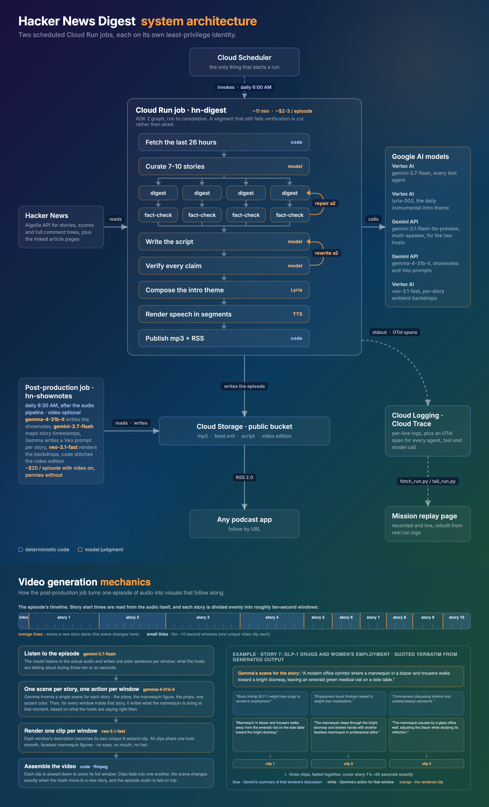
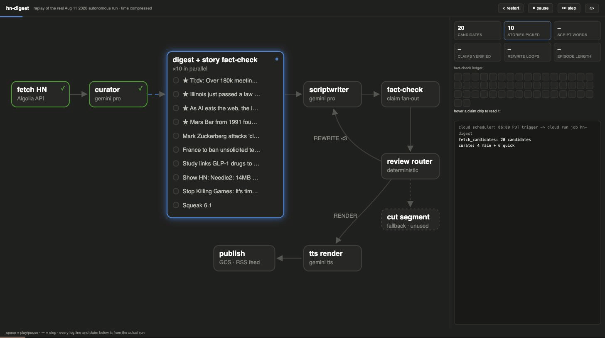
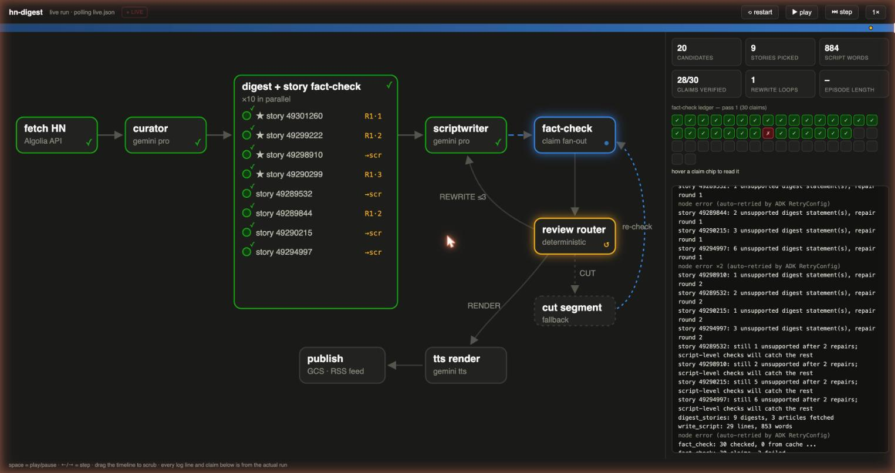

# Hacker News Digest

A fully automated system that generates a daily podcast summarizing Hacker News, with fact-checking loops to ensure accuracy.

Every morning at 6 AM Pacific, a Cloud Run job reads the last 26 hours of Hacker News and picks the stories worth talking about. It summarizes and fact-checks each story against the linked articles and comment threads, then writes a two-host script. Lyria composes an intro theme to match the day's headlines, multi-speaker Gemini TTS generates the audio, and the job publishes the episode to a public RSS feed you can follow in any podcast app.

A post-production job then runs at 6:30. Gemma writes the episode's description into the podcast feed. For the video edition, Gemini listens to the episode, and based on that, Gemma turns each story into a series of video prompts that Veo can use.

- **Listen / demo page**: https://ykdojo.github.io/awesome-agents-on-google-cloud/hn-podcast-demo/
- **Write-up**: [Turning Hacker News into a daily podcast with ADK 2, Gemini TTS, and Cloud Run jobs](https://medium.com/google-cloud/turning-hacker-news-into-a-daily-podcast-with-adk-2-gemini-tts-and-cloud-run-jobs-02c2d53fdcf2)
- **Demo video**: https://www.youtube.com/watch?v=KDKNnr_98us

Built for the [All Things Agentic Hackathon](https://allthingsagentichackathon.devpost.com/) (category: Taskmaster).

## Architecture



Deterministic code owns the structure of the ADK agent graph. It also handles:

- fetching the stories and their linked articles
- scoring them by points and comment activity to select the initial pool of candidate stories
- the claim ledger (the record of every checked claim, published with each episode)
- publishing

Models own only what needs judgment:

- picking the 7-10 stories for the episode out of the candidate pool
- generating summaries
- writing the script
- extracting claims and fact-checking them
- composing the intro theme (Lyria)
- voicing the two hosts (text-to-speech)
- rendering the video edition's clips (Veo)

Every text output in the primary pipeline (all Gemini Flash) is validated against a schema with Pydantic structured outputs.

Verification runs at two levels. Each story's summary gets its own fact-check with up to 2 repair rounds. Then the finished script goes through a claim-by-claim check with a rewrite loop. A segment that still fails is cut rather than aired.

The stack:

- **Google ADK 2** for the agent graph
- **Gemini 3.7 Flash** through Vertex AI for all of the primary job's text agents
- **Lyria** for the intro theme
- **multi-speaker Gemini TTS** for the two hosts
- **Gemma** for shownotes and Veo prompts
- **Veo** for the video edition
- **Cloud Run jobs** and **Cloud Scheduler** to run it daily
- **Cloud Storage** to host the feed and episodes
- **Secret Manager** for the API key
- **Cloud Logging** and **Cloud Trace** for logs and per-step traces

Both jobs run on dedicated least-privilege service accounts. The TTS step is the one call that uses the Gemini API with an API key instead of Vertex AI, because the multi-speaker preview voices are served there.

### Post-production job

Frames from a video edition - Gemma writes each scene, Veo renders it:

  

[shownotes/](shownotes/) is a second Cloud Run job that runs after the audio pipeline. Gemma writes the episode description into the RSS feed, and Veo renders the optional video edition. The mechanics are in the architecture diagram above.

The video is opt-in via `VIDEO=1` and costs roughly US$60 per episode, almost all of it Veo rendering. The shownotes step costs pennies.

## Run it yourself, step by step

The goal: from a fresh clone to a real episode running on Cloud Run. Every command is copy-pasteable after setting the four variables in step 2. The pipeline code itself lives in [pipeline/](pipeline/).

1. **Prereqs**: a Google Cloud project with billing enabled, the `gcloud` CLI logged in (`gcloud auth login && gcloud auth application-default login`), Python 3.12+. Get a Gemini API key (free tier works) from https://aistudio.google.com/apikey for the TTS calls.

   A new project or an existing one both work. An existing one is smoother, since Cloud Build and Vertex AI quota are usually already set up.
2. **Clone and set variables**:

   ```bash
   git clone https://github.com/ykdojo/hacker-news-digest.git
   cd hacker-news-digest/pipeline
   export PROJECT=your-project-id REGION=us-central1 BUCKET=your-bucket-name KEY=your-gemini-api-key
   gcloud config set project $PROJECT
   ```

3. **Enable APIs**:

   ```bash
   gcloud services enable run.googleapis.com cloudbuild.googleapis.com \
     artifactregistry.googleapis.com storage.googleapis.com aiplatform.googleapis.com \
     cloudscheduler.googleapis.com telemetry.googleapis.com cloudtrace.googleapis.com
   ```

4. **Create the public bucket** (feed + episodes):

   ```bash
   gcloud storage buckets create gs://$BUCKET --location=$REGION
   gcloud storage buckets add-iam-policy-binding gs://$BUCKET \
     --member=allUsers --role=roles/storage.objectViewer
   ```

5. **Quick local test first**. A dry run executes the full text pipeline: fetching and curating stories, digesting them, writing the script, and fact-checking the claims. No TTS and no publishing. Edit `PROJECT` at the top of `run_local.py`, then:

   ```bash
   python3 -m venv .venv && source .venv/bin/activate
   python3 -m pip install -r requirements.txt
   DRY_RUN=1 GEMINI_API_KEY=$KEY python run_local.py
   ```

   Tip: add `WINDOW_HOURS=3` to look at a shorter slice of Hacker News and cut the dry run's cost and time.
6. **Build and deploy the job**:

   ```bash
   gcloud artifacts repositories create pipeline --repository-format=docker --location=$REGION 2>/dev/null || true

   # Give Cloud Build a service account to run as (new projects no longer get
   # the legacy Cloud Build account automatically). Safe to re-run.
   export SA=$(gcloud iam service-accounts list --filter="email~compute@developer" --format="value(email)")
   for role in cloudbuild.builds.builder artifactregistry.writer storage.admin logging.logWriter; do
     gcloud projects add-iam-policy-binding $PROJECT \
       --member="serviceAccount:$SA" --role="roles/$role" --condition=None >/dev/null
   done

   gcloud builds submit --tag $REGION-docker.pkg.dev/$PROJECT/pipeline/hn-digest \
     --service-account=projects/$PROJECT/serviceAccounts/$SA \
     --default-buckets-behavior=regional-user-owned-bucket
   gcloud run jobs create hn-digest --region $REGION \
     --image $REGION-docker.pkg.dev/$PROJECT/pipeline/hn-digest --task-timeout 3600 \
     --set-env-vars "GOOGLE_GENAI_USE_ENTERPRISE=TRUE,GOOGLE_CLOUD_LOCATION=global,GOOGLE_CLOUD_PROJECT=$PROJECT,PUBLISH_BUCKET=$BUCKET,STORY_CHECK=1,ENABLE_TRACING=1,PYTHONUNBUFFERED=1,GEMINI_API_KEY=$KEY"
   ```

7. **Run it** (~14-18 min, ~US$2-3 in model calls):

   ```bash
   gcloud run jobs execute hn-digest --region $REGION
   ```

   Watch progress in the Cloud Run console (execution logs), or live-tail it into the replay page (step 9).

   A note on quota. The pipeline summarizes stories in parallel, and a brand new project starts with very little `gemini-3.7-flash` quota, so calls can come back with a 429 error. If that happens, request quota for the model or set `MAX_PICKS=3` so fewer stories are summarized in parallel.
8. **Subscribe**: when the run finishes, paste `https://storage.googleapis.com/$BUCKET/feed.xml` into any podcast app that follows shows by URL. The episode mp3, script, and claim ledger are all in the bucket.
9. **Watch it as a mission replay** (optional, no extra credentials): see [replay](replay/). `fetch_run.py --date YYYY-MM-DD` rebuilds any past run into an animated replay, and `tail_run.py` live-tails a running one.
10. **Traces** (optional): with `ENABLE_TRACING=1` set (step 6 sets it), every agent/tool/model step shows up in Cloud Trace: Console > Trace explorer.
11. **Make it daily** (optional):

    ```bash
    export SERVICE_ACCOUNT=$(gcloud iam service-accounts list --filter="email~compute@developer" --format="value(email)")
    gcloud scheduler jobs create http hn-digest-morning \
      --schedule="0 6 * * *" --time-zone="America/Los_Angeles" \
      --uri="https://run.googleapis.com/v2/projects/$PROJECT/locations/$REGION/jobs/hn-digest:run" \
      --oauth-service-account-email=$SERVICE_ACCOUNT
    ```

### Deploy the post-production job (optional, after the pipeline works)

Same variables as step 2 (plus `$SA` from step 6). Least privilege: the job gets its own service account with only Vertex AI, bucket access, logs, and the API-key secret.

```bash
cd ../shownotes

# service account with minimum permissions
gcloud iam service-accounts create hn-shownotes-job
export JOB_SA=hn-shownotes-job@$PROJECT.iam.gserviceaccount.com
for role in aiplatform.user logging.logWriter; do
  gcloud projects add-iam-policy-binding $PROJECT \
    --member="serviceAccount:$JOB_SA" --role="roles/$role" --condition=None >/dev/null
done
gcloud storage buckets add-iam-policy-binding gs://$BUCKET \
  --member="serviceAccount:$JOB_SA" --role=roles/storage.objectAdmin

# the Gemini API key lives in Secret Manager, not env vars
gcloud services enable secretmanager.googleapis.com
printf '%s' "$KEY" | gcloud secrets create gemini-api-key --data-file=-
gcloud secrets add-iam-policy-binding gemini-api-key \
  --member="serviceAccount:$JOB_SA" --role=roles/secretmanager.secretAccessor

# build and create the job (shownotes only; append ,VIDEO=1 to the env vars
# to enable the video edition - Veo costs roughly US$60 per episode)
gcloud builds submit --tag $REGION-docker.pkg.dev/$PROJECT/pipeline/hn-shownotes \
  --service-account=projects/$PROJECT/serviceAccounts/$SA \
  --default-buckets-behavior=regional-user-owned-bucket
gcloud run jobs create hn-shownotes --region $REGION \
  --image $REGION-docker.pkg.dev/$PROJECT/pipeline/hn-shownotes \
  --service-account=$JOB_SA --task-timeout 1800 --memory 4Gi --cpu 2 \
  --set-env-vars "PUBLISH_BUCKET=$BUCKET,GOOGLE_CLOUD_PROJECT=$PROJECT,GOOGLE_CLOUD_LOCATION=global,PYTHONUNBUFFERED=1" \
  --set-secrets "GEMINI_API_KEY=gemini-api-key:latest"

# run it for today's episode (the pipeline must have published first)
gcloud run jobs execute hn-shownotes --region $REGION

# optional: schedule it daily at 6:30 AM PT, after the 6:00 pipeline
export SERVICE_ACCOUNT=$(gcloud iam service-accounts list --filter="email~compute@developer" --format="value(email)")
gcloud scheduler jobs create http hn-shownotes-morning \
  --schedule="30 6 * * *" --time-zone="America/Los_Angeles" \
  --uri="https://run.googleapis.com/v2/projects/$PROJECT/locations/$REGION/jobs/hn-shownotes:run" \
  --oauth-service-account-email=$SERVICE_ACCOUNT
```

Local dry run (shownotes only, no video, costs pennies):

```bash
python3 -m venv .venv && source .venv/bin/activate
pip install -r requirements.txt
GEMINI_API_KEY=$KEY PUBLISH_BUCKET=$BUCKET GOOGLE_CLOUD_PROJECT=$PROJECT \
  EPISODE_DATE=YYYY-MM-DD python shownotes.py
```

### Environment reference

- `GEMINI_API_KEY`: key for the TTS calls (free tier works)
- `GOOGLE_GENAI_USE_ENTERPRISE=TRUE` plus application default credentials: for the text models, billed to your Cloud project
- `GOOGLE_CLOUD_LOCATION=global`: which Vertex AI endpoint serves the text-model calls. The global endpoint has the best model availability; a specific region also works
- `PUBLISH_BUCKET`: Cloud Storage bucket name. Unset writes to `./out` locally
- `STORY_CHECK=1`: per-story fact-checking. Recommended. It beat script-level-only checking in testing
- `DRY_RUN=1`: stop before TTS and publishing, for cheap logic tests
- `ENABLE_TRACING=1`: export agent/tool/model spans to Cloud Trace
- `WINDOW_HOURS`: lookback window in hours, default 26
- `MAX_PICKS`: maximum stories per episode, default 10. Also caps how many are summarized in parallel
- `SEGMENT_WORDS`: target words per TTS segment, default 160 (about a minute of speech)
- `SEAM_GAP_MS`: silence inserted between TTS segments, default 350
- `INTRO_MUSIC=0`: disable the Lyria intro theme, which is on by default. A Lyria failure just skips the music

## Mission replay

[replay/](replay/) replays a real production run from the actual Cloud Run logs and claim ledger. The agent graph lights up stage by stage, story lanes show repair rounds, and a rewrite loop fires when a claim fails. Recorded mode replays any past run. Live mode tails a run in progress. Tests in [replay/testing.md](replay/testing.md).

```bash
cd replay && python3 -m http.server 8000   # then open http://localhost:8000
```



An example from a live-tailed run. The fact-check found 2 bad claims (the red chips), the router went amber, and REWRITE #1 fired, all while the run was still going:



The replay needs no hooks inside the pipeline and no credentials in the browser. It rebuilds everything from the run's own logs, either live or after the fact.

## Repo map

| Path | What it is |
|---|---|
| [pipeline/](pipeline/) | the entire pipeline |
|  [shownotes/](shownotes/) | post-production job: Gemma shownotes + Veo video edition |
| [replay/](replay/) | mission replay page (recorded + live) |
| [assets/](assets/) | diagram + cover sources and render scripts |
