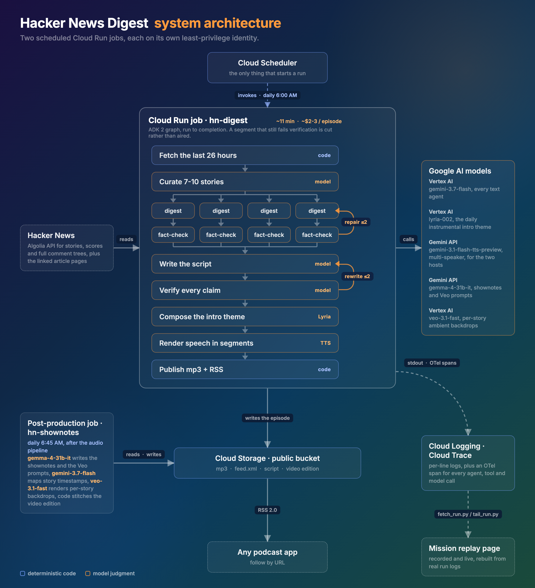

# Hacker News Digest

A system that generates a daily podcast summarizing Hacker News, with fact-checking loops to ensure accuracy.

Every morning at 6 AM Pacific, a Cloud Run job reads the last 26 hours of Hacker News and picks the stories worth talking about. It digests and fact-checks each story against the linked articles and comment threads, then writes a two-host script. Lyria composes an intro theme to match the day's headlines, multi-speaker Gemini TTS generates the audio, and the job publishes the episode to a public RSS feed you can follow in any podcast app. A post-production job then has Gemma write the episode's shownotes and Veo render per-story ambient backdrops for a video edition.

- **Listen / demo page**: https://ykdojo.github.io/awesome-agents-on-google-cloud/hn-podcast-demo/
- **Write-up**: [Turning Hacker News into a daily podcast with ADK 2, Gemini TTS, and Cloud Run jobs](https://medium.com/google-cloud/turning-hacker-news-into-a-daily-podcast-with-adk-2-gemini-tts-and-cloud-run-jobs-02c2d53fdcf2)
- **Demo video**: https://www.youtube.com/watch?v=KDKNnr_98us

Built for the [All Things Agentic Hackathon](https://allthingsagentichackathon.devpost.com/) (category: Taskmaster).

## Architecture



Deterministic code owns the graph structure, fetching, scoring, the claim ledger, routing, TTS, the intro-music mix, and publishing. Models own only what needs judgment: curation, digests, script-writing, claim extraction, fact-check verdicts, and the intro-music prompt. Every model output is schema-validated with Pydantic structured outputs.

Verification runs at two levels: each story digest gets its own fact-check lane with up to 2 repair rounds, and the finished script goes through a claim-by-claim check with a rewrite loop. A segment that still fails verification is cut rather than aired, and every episode publishes its claim ledger next to the audio so any line of the show traces back to a verified claim.

Stack: **Google ADK 2** (graph workflow with dynamic per-story fan-out), **Gemini 3.7 Flash** through Vertex AI for all text agents, **Lyria** through Vertex AI for a daily instrumental intro theme, **multi-speaker Gemini TTS** through the Gemini API for the two hosts, **Gemma** through the Gemini API for shownotes and Veo prompts, **Veo** through Vertex AI for the video edition's backdrops, **Cloud Run jobs** + **Cloud Scheduler**, **Cloud Storage**, **Secret Manager**, **Cloud Logging** + **Cloud Trace** (OpenTelemetry spans for every agent, tool, and model call). Both jobs run on dedicated least-privilege service accounts. More detail in [architecture.md](architecture.md).

### Post-production job

[shownotes/](shownotes/) is a second, deliberately tiny Cloud Run job scheduled after the audio pipeline. It reads the day's published script, has **Gemma** write the listener-facing episode description into the RSS feed, maps each story's start time from the audio (Gemini audio understanding, snapped to the silences the pipeline inserts between segments), has Gemma write a per-story Veo prompt, renders an 8-second ambient backdrop per story with **Veo**, and stitches them under the episode audio into `episodes/DATE-video.mp4`. Any failure leaves the feed exactly as the pipeline published it.

## Run it yourself, step by step

The goal: from a fresh clone to a real episode running on Cloud Run. Every command is copy-pasteable after setting the four variables in step 2. The pipeline code itself lives in [pipeline/](pipeline/), with a file map in [pipeline/README.md](pipeline/README.md).

1. **Prereqs**: a Google Cloud project with billing enabled, the `gcloud` CLI logged in (`gcloud auth login && gcloud auth application-default login`), Python 3.12+. Get a Gemini API key (free tier works) from https://aistudio.google.com/apikey for the TTS calls.

   Either a new project or one you already use works. An existing project is the smoother path, since Cloud Build and Vertex AI quota are usually set up already. Everything below works on a new project too.
2. **Clone and set variables**:

   ```bash
   git clone https://github.com/ykdojo/hacker-news-digest.git
   cd hacker-news-digest/pipeline
   export PROJECT=your-project-id REGION=us-central1 BUCKET=your-bucket-name KEY=your-gemini-api-key
   gcloud config set project $PROJECT
   ```

3. **Enable APIs**:

   ```bash
   gcloud services enable run.googleapis.com cloudbuild.googleapis.com \
     artifactregistry.googleapis.com storage.googleapis.com aiplatform.googleapis.com \
     cloudscheduler.googleapis.com telemetry.googleapis.com cloudtrace.googleapis.com
   ```

4. **Create the public bucket** (feed + episodes):

   ```bash
   gcloud storage buckets create gs://$BUCKET --location=$REGION
   gcloud storage buckets add-iam-policy-binding gs://$BUCKET \
     --member=allUsers --role=roles/storage.objectViewer
   ```

5. **Cheap local test first**. No TTS and no publishing, so it stops before the paid steps. Edit `PROJECT` at the top of `run_local.py`, then:

   ```bash
   python3 -m venv .venv && source .venv/bin/activate
   python3 -m pip install -r requirements.txt
   DRY_RUN=1 GEMINI_API_KEY=$KEY python run_local.py
   ```

   A virtualenv keeps this off your system Python. On many setups a bare `pip install` either fails with `externally-managed-environment` or `pip` is not on PATH at all. Tip: add `WINDOW_HOURS=3` to look at a shorter slice of Hacker News and cut the dry run's cost and time.
6. **Build and deploy the job**:

   ```bash
   gcloud artifacts repositories create pipeline --repository-format=docker --location=$REGION 2>/dev/null || true

   # Give Cloud Build a service account to run as. Safe to re-run on a project
   # that already builds. New projects need it, since they no longer get the
   # legacy Cloud Build account automatically.
   export SA=$(gcloud iam service-accounts list --filter="email~compute@developer" --format="value(email)")
   for role in cloudbuild.builds.builder artifactregistry.writer storage.admin logging.logWriter; do
     gcloud projects add-iam-policy-binding $PROJECT \
       --member="serviceAccount:$SA" --role="roles/$role" --condition=None >/dev/null
   done

   gcloud builds submit --tag $REGION-docker.pkg.dev/$PROJECT/pipeline/hn-digest \
     --service-account=projects/$PROJECT/serviceAccounts/$SA \
     --default-buckets-behavior=regional-user-owned-bucket
   gcloud run jobs create hn-digest --region $REGION \
     --image $REGION-docker.pkg.dev/$PROJECT/pipeline/hn-digest --task-timeout 3600 \
     --set-env-vars "GOOGLE_GENAI_USE_ENTERPRISE=TRUE,GOOGLE_CLOUD_LOCATION=global,GOOGLE_CLOUD_PROJECT=$PROJECT,PUBLISH_BUCKET=$BUCKET,STORY_CHECK=1,ENABLE_TRACING=1,PYTHONUNBUFFERED=1,GEMINI_API_KEY=$KEY"
   ```

7. **Run it** (~30 min, ~US$2-3 in model calls):

   ```bash
   gcloud run jobs execute hn-digest --region $REGION
   ```

   Watch progress in the Cloud Run console (execution logs), or live-tail it into the replay page (step 9).

   A note on quota. The pipeline digests stories in parallel, so it needs some Vertex AI throughput for `gemini-3.7-flash`. A project you already use for Vertex AI normally has plenty. A brand new project starts with very little, and calls can come back with a 429. If that happens, either request quota for the model or set `WINDOW_HOURS=4` so fewer stories run at once.
8. **Subscribe**: when the run finishes, paste `https://storage.googleapis.com/$BUCKET/feed.xml` into any podcast app that follows shows by URL (Pocket Casts, Overcast, Apple Podcasts "Follow a Show by URL"). The episode mp3, script, and claim ledger are all in the bucket.
9. **Watch it as a mission replay** (optional, no extra credentials): see [prototypes/replay](prototypes/replay/). `fetch_run.py --date YYYY-MM-DD` rebuilds any past run into an animated replay, and `tail_run.py` live-tails a running one.
10. **Traces** (optional): with `ENABLE_TRACING=1` set (step 6 sets it), every agent/tool/model step shows up in Cloud Trace: Console > Trace explorer.
11. **Make it daily** (optional):

    ```bash
    export SERVICE_ACCOUNT=$(gcloud iam service-accounts list --filter="email~compute@developer" --format="value(email)")
    gcloud scheduler jobs create http hn-digest-morning \
      --schedule="0 6 * * *" --time-zone="America/Los_Angeles" \
      --uri="https://run.googleapis.com/v2/projects/$PROJECT/locations/$REGION/jobs/hn-digest:run" \
      --oauth-service-account-email=$SERVICE_ACCOUNT
    ```

### Environment reference

- `GEMINI_API_KEY`: key for the TTS calls (free tier works)
- `GOOGLE_GENAI_USE_ENTERPRISE=TRUE` plus application default credentials: for the text models, billed to your Cloud project
- `GOOGLE_CLOUD_LOCATION=global`
- `PUBLISH_BUCKET`: Cloud Storage bucket name. Unset writes to `./out` locally
- `STORY_CHECK=1`: per-story digest fact-checking. Recommended; it beat script-level-only checking in testing
- `DRY_RUN=1`: stop before TTS and publishing, for cheap logic tests
- `ENABLE_TRACING=1`: export agent/tool/model spans to Cloud Trace (service account needs `roles/cloudtrace.agent`, then view at Console > Trace explorer)
- `WINDOW_HOURS`: lookback window in hours, default 26
- `SEGMENT_WORDS`: target words per TTS segment, default 160 (about a minute of speech). Segments break only between speaker turns, and prefer to break where a new story starts
- `SEAM_GAP_MS`: silence inserted between TTS segments, default 350
- `INTRO_MUSIC=0`: disable the Lyria-generated intro theme, which is on by default. A `music_director` agent writes a music prompt from the day's headlines, Lyria renders a short instrumental clip, and ffmpeg fades it under the hosts' opening lines. Any Lyria failure just skips the music

## Mission replay

[prototypes/replay/](prototypes/replay/) is an interactive replay of a real production run, built from the actual Cloud Run logs and the episode's claim ledger. The agent graph lights up stage by stage, story lanes show repair rounds, claim chips fill in as verification passes, and a rewrite loop fires on camera when a claim fails. It has a recorded mode (any past run via `fetch_run.py --date`) and a live mode that tails a run in progress. Tests and usage in [prototypes/replay/testing.md](prototypes/replay/testing.md).

```bash
cd prototypes/replay && python3 -m http.server 8000   # then open http://localhost:8000
```


The moment that matters, from a live-tailed run. The fact-check found 2 bad claims (the red chips), the router went amber, and REWRITE #1 fired, all while the run was still going:


## Repo map

| Path | What it is |
|---|---|
| [pipeline/](pipeline/) | the entire pipeline + file map |
| [shownotes/](shownotes/) | post-production job: Gemma shownotes + Veo video edition |
| [prototypes/replay/](prototypes/replay/) | mission replay page (recorded + live) |
| [architecture.md](architecture.md) | system architecture, diagram + text |
| [assets/](assets/) | diagram + cover sources and render scripts |
