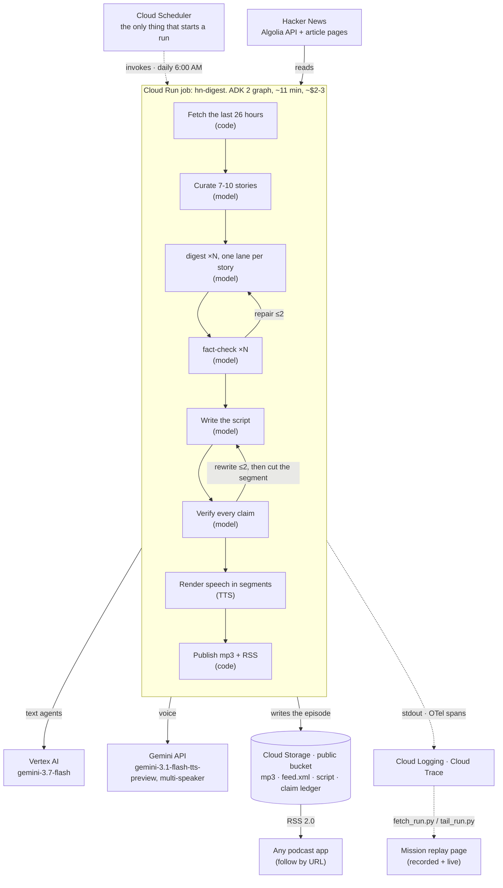

# System architecture

The diagram submitted to Devpost is [assets/architecture.png](assets/architecture.png), generated from [assets/architecture-diagram.html](assets/architecture-diagram.html) via `python3 assets/render_architecture.py`. Devpost requires the diagram as an uploaded file, not as a description, and it shares the dark cover style used for the article.

The per-node agent graphs (7 diagrams) are in the [article](https://medium.com/google-cloud/turning-hacker-news-into-a-daily-podcast-with-adk-2-gemini-tts-and-cloud-run-jobs-02c2d53fdcf2). This is the system-level picture the submission rules ask for.

## The same thing as text

Three different kinds of thing touch the job, and they are not peers. Cloud Scheduler is the control plane and only invokes. Hacker News is the data input and is only read. The Gemini models are dependencies the job calls out to. Everything else is downstream.

The models are reached two different ways. Every text agent runs on **gemini-3.7-flash through Vertex AI**, authenticated with the project's own credentials and billed to that project. The **text-to-speech** step is the exception. It calls **gemini-3.1-flash-tts-preview through the Gemini API** with an API key, because the multi-speaker preview voices are served there.

## Design principles

Deterministic code owns the graph structure, fetching, scoring, the claim ledger, routing, TTS, and publishing. Models own only curation, digests, script-writing, claim extraction, and fact-check verdicts. Every model output is schema-validated with Pydantic structured outputs.

Verification runs at two levels. Every story digest gets its own fact-check lane with up to 2 repair rounds, and the finished script goes through a claim-by-claim check with a rewrite loop before anything is rendered. A segment that still fails verification is cut rather than aired, which is why an episode can come in shorter than planned.

The job is stateless and run-to-completion. There are no servers between runs, so a failed run costs one execution rather than a standing service, and the idle system costs nothing.
